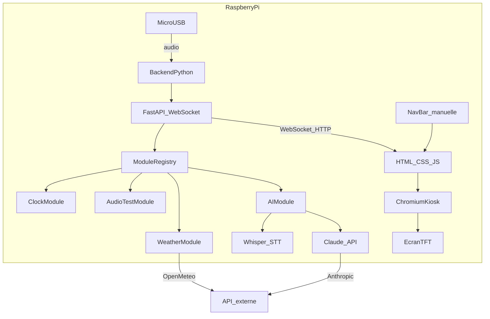
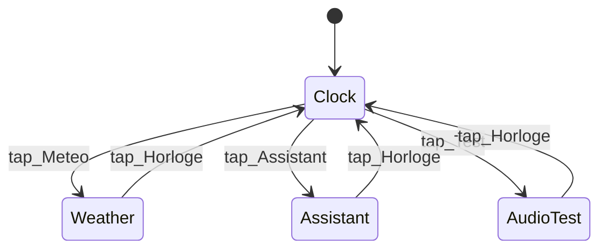
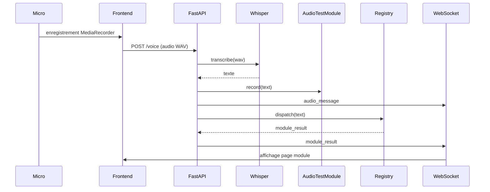

# Architecture — Assistant Raspberry Pi

Document technique de référence. Guide pédagogique détaillé : [project.md](project.md).  
Configuration matérielle pas à pas : [trame.md](trame.md).

---

## Vue d'ensemble

Assistant personnel embarqué sur Raspberry Pi : backend Python modulaire, interface web en kiosk Chromium sur écran TFT, commande vocale via micro USB.



### Composants

| Composant | Rôle |
|---|---|
| **Backend Python** | Orchestrateur, registre de modules, API REST + WebSocket |
| **FastAPI** | Sert le frontend, route les requêtes texte/voix vers les modules |
| **Frontend HTML/CSS/JS** | SPA multi-pages, affichée en plein écran (kiosk) |
| **Micro USB** | Capture voix, déclenche la chaîne STT → dispatch |
| **Chromium kiosk** | Affiche `http://localhost:8000` au démarrage |

---

## Contraintes matérielles

- **Raspberry Pi 4 ou 5**, 4 Go RAM minimum (module IA local Whisper)
- **Écran TFT** : HDMI officiel recommandé pour un premier projet (plug-and-play) ; SPI possible mais driver à installer
- **Micro USB** : simple ou conférence 360°
- **Carte micro-SD** 32 Go+, classe A2
- Alimentation officielle Raspberry Pi

---

## Arborescence cible

```
assistant/
├── ARCHITECTURE.md          # ce document
├── AGENTS.md                # guide agents Cursor
├── project.md               # guide père/fils
├── trame.md                 # procédures setup Pi
├── backend/
│   ├── main.py              # FastAPI + WebSocket + routes
│   ├── requirements.txt
│   ├── modules/
│   │   ├── base.py          # interface Module (ABC)
│   │   ├── registry.py      # ModuleRegistry
│   │   ├── clock.py         # heure / date
│   │   ├── weather.py       # météo Open-Meteo
│   │   ├── audio_test.py    # journal transcriptions audio
│   │   ├── ai.py            # fallback conversationnel
│   │   ├── stt.py           # Whisper (voix → texte)
│   │   ├── brain.py         # Claude API
│   │   └── tts.py           # Piper TTS (optionnel)
│   └── tests/
│       └── mic_test.py
├── frontend/
│   ├── index.html
│   ├── style.css
│   └── app.js
└── deploy/                  # templates systemd, autostart (Phase 4)
    ├── assistant-backend.service
    ├── assistant-kiosk.desktop
    └── .env.example
```

### État actuel

Implémenté : architecture modulaire complète, navigation frontend 4 pages, routes `/ask`, `/voice`, `/audio-log`, templates `deploy/`.

---

## Architecture modulaire

### Contrat `Module`

Chaque module implémente l'interface définie dans `backend/modules/base.py` :

```python
class Module(ABC):
    name: str = "base"

    @abstractmethod
    def can_handle(self, query: str) -> bool:
        """Return True if this module can handle the query."""

    @abstractmethod
    def run(self, query: str) -> dict:
        """Execute and return a JSON-serializable dict for the frontend."""
```

### Registre

`ModuleRegistry` (`backend/modules/registry.py`) :

- `register(module)` — enregistre un module
- `dispatch(query)` — parcourt les modules dans l'ordre d'enregistrement ; **premier match gagne**
- Retourne `{"module": "<name>", **module.run(query)}` ou `None`

`AIModule` est enregistré **en dernier** : `can_handle` retourne toujours `True` (fallback).

### Modules prévus

| `name` | Fichier | Rôle | Keywords (exemples) |
|---|---|---|---|
| `clock` | `clock.py` | Heure et date | heure, time, quelle heure |
| `weather` | `weather.py` | Météo Open-Meteo | météo, temps, température |
| `audio_test` | `audio_test.py` | Journal transcriptions STT | test, test micro, debug audio |
| `ai` | `ai.py` | Réponses Claude (fallback) | *(tout le reste)* |

`AudioTestModule` expose aussi `record(text)` — appelé systématiquement par `/voice` avant le dispatch, indépendamment de `can_handle`.

---

## API REST

| Méthode | Route | Description |
|---|---|---|
| `GET` | `/` | Page frontend (`index.html`) |
| `GET` | `/static/*` | Assets CSS/JS |
| `GET` | `/ask?q=` | Dispatch texte via registry |
| `POST` | `/voice` | Upload audio WAV → STT → audio_test → dispatch |
| `GET` | `/audio-log` | Historique des transcriptions (Phase 3a) |

### Exemples de réponses `/ask`

```json
{"module": "clock", "time": "14:32:05", "date": "Saturday 15 August 2026"}
{"module": "weather", "temperature": 22.5, "description": "Partiellement nuageux"}
{"error": "Aucun module ne sait répondre à ça"}
```

---

## WebSocket `/ws`

Connexion persistante frontend ↔ backend. Messages JSON typés :

### Horloge (chaque seconde)

```json
{"type": "clock", "module": "clock", "value": "14:32:05", "date": "samedi 15 août 2026"}
```

Sourcé par `ClockModule` (Phase 1b). État actuel : logique inline dans `main.py`.

### Résultat module

```json
{"type": "module_result", "module": "weather", "temperature": 22.5, "description": "..."}
```

Émis après dispatch vocal ou requête serveur.

### Message audio (transcription)

```json
{"type": "audio_message", "text": "quelle est la météo", "timestamp": "2026-08-15T14:32:05"}
```

Émis par `AudioTestModule` à chaque réception `/voice`, avant le dispatch.

### Reconnexion

Le frontend recharge la page après 3 s si la connexion WebSocket est perdue (`app.js`).

---

## Frontend — navigation multi-pages

SPA à panneaux : une page visible à la fois, pilotage manuel via barre de navigation fixe en bas (zones tactiles ≥ 48 px, adapté TFT).



| Page ID | Bouton nav | Contenu |
|---|---|---|
| `clock` | Horloge | Heure + date (WebSocket) |
| `weather` | Météo | Température, description (fetch `/ask`) |
| `assistant` | Assistant | Question/réponse IA + micro |
| `audio_test` | Test | Journal transcriptions audio |

**Manuel** : clic sur `#nav-bar` → `showPage(pageId)`.  
**Auto** : `module_result` ou `audio_message` WebSocket → bascule vers la page du module concerné.

Fonctions JS clés : `showPage()`, `onPageShow(pageId)` (refresh à l'affichage).

---

## Flux voix



Paramètres audio : **16 kHz**, mono, int16 (compatible Whisper).  
Modèle STT par défaut : `tiny` (option `base` si le Pi le supporte).  
TTS optionnel : Piper (`fr_FR-siwis-medium`) + `aplay`.

---

## Déploiement

### Prérequis

```bash
python3 -m venv ~/assistant-env
source ~/assistant-env/bin/activate
pip install -r backend/requirements.txt
```

Lancer uvicorn **depuis `backend/`** (chemins relatifs `../frontend`) :

```bash
cd backend && uvicorn main:app --host 0.0.0.0 --port 8000
```

### Variables d'environnement

| Variable | Usage |
|---|---|
| `ANTHROPIC_API_KEY` | Module IA (Claude) |
| `LAT` | Latitude météo (défaut : Paris) |
| `LON` | Longitude météo |

Fichier `deploy/.env.example` — jamais committer de secrets.

### systemd (backend)

```ini
[Service]
User=pi
WorkingDirectory=/home/pi/assistant/backend
EnvironmentFile=/home/pi/assistant/deploy/.env
ExecStart=/home/pi/assistant-env/bin/uvicorn main:app --host 0.0.0.0 --port 8000
Restart=on-failure
```

### Autostart kiosk

Chromium en plein écran au démarrage graphique :

```
Exec=chromium-browser --kiosk --noerrdialogs --disable-infobars http://localhost:8000
```

Fichier : `~/.config/autostart/assistant-kiosk.desktop` (template dans `deploy/`).

---

## Décisions techniques

| Choix | Justification |
|---|---|
| FastAPI + uvicorn | Légère, async, WebSocket natif |
| Vanilla HTML/CSS/JS | Pas de build step, adapté Pi et pédagogie |
| Open-Meteo | Météo sans clé API |
| Whisper local | STT offline, pas de latence réseau |
| Claude via API | Qualité réponses, charge CPU sur le Pi limitée |
| Premier match registry | Comportement prévisible, ordre d'enregistrement explicite |
| Chemin `../frontend` | Simple ; uvicorn lancé depuis `backend/` |

---

## Risques connus

| Risque | Mitigation |
|---|---|
| Whisper lourd sur Pi | Modèle `tiny` par défaut |
| Chemin relatif frontend | Toujours lancer depuis `backend/` |
| Clé API exposée | `EnvironmentFile`, pas de secret dans le code |
| Écran SPI complexe | Préférer HDMI pour le premier projet |
